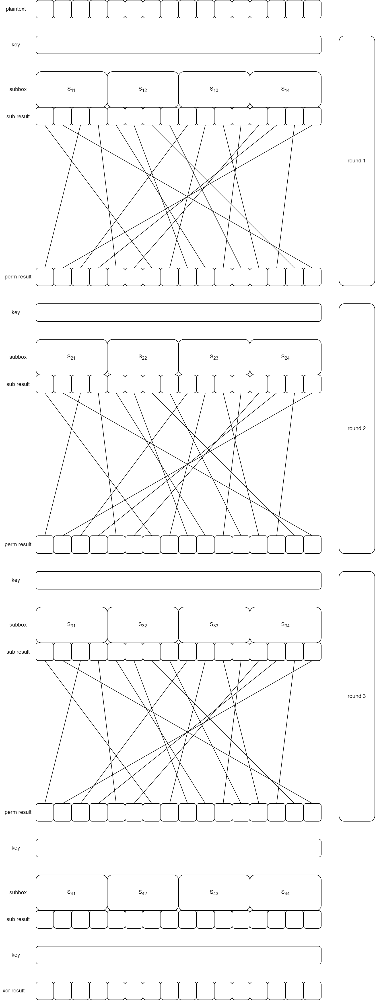

# CZ4010 Project Topic #7 : Demonstration of attacks on Substitution Permutation Network  Ciphers

# Motivation

This project aims to implement a reduced size Substitution Permutation Network (SPN), and to subsequently demonstrate an attack on the Cipher through Linear Cryptanalysis. The demonstrated attack will be a Known Plaintext Attack, where the attacker will have both the plaintext and their corresponding ciphertexts.

SPNs are a commonly used in block cipher algorithms such as AES. Therefore, it is important to study the strengths and weaknesses of this implementation.

Linear and Differential Cryptanalysis are commonly applied to block ciphers. In this demonstration, we will be focusing on Linear Cryptanalysis where we aim to find approximations to the action of a cipher.

# Research

For this project, a basic understanding of the SPN is required, as well as some research done on how Linear Cryptanalysis is implemented. Our implementation closely references the paper on [Linear (and Differential) Cryptanalysis by Howard M. Heys](https://ioactive.com/wp-content/uploads/2015/07/ldc_tutorial.pdf).

The paper demonstrates an attack on the [first substitution box chosen from the S-boxes of DES](https://en.wikipedia.org/wiki/DES_supplementary_material#Substitution_boxes_(S-boxes)). 

# Design

For our project, we implemented 4 layers to the SPN, with identical subtition boxes and permutation boxes being used across the layers. As the SPN takes in 16-bit plaintext input, 4 substitution boxes are used in each layer. Each layer uses identical round keys.

## Substitution Permutation Network

# Development

1. We implemented an SPN as described in [Design](#design)

# Usage of code